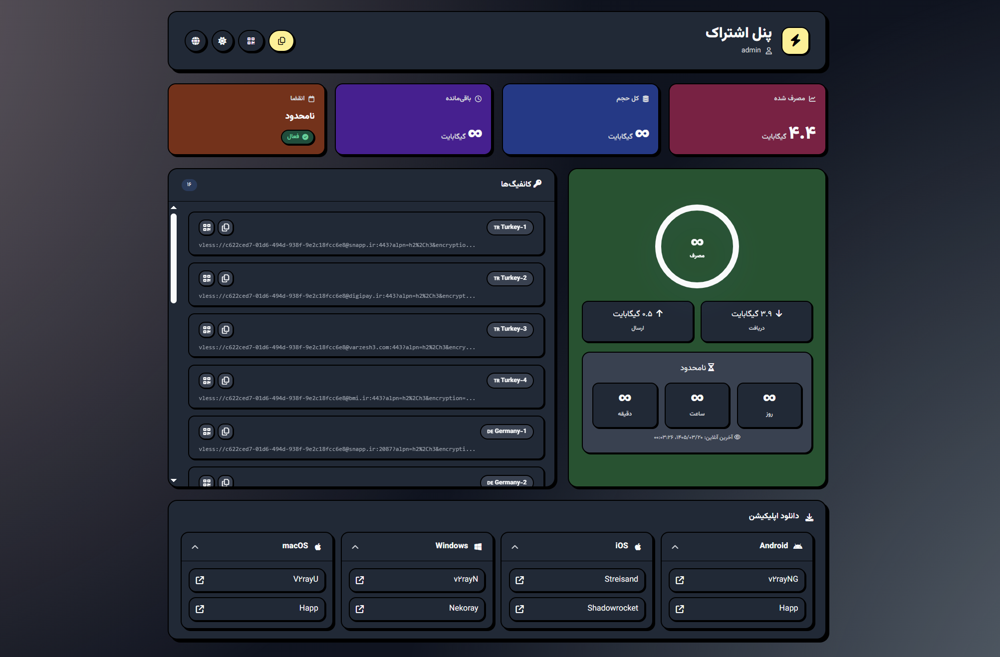
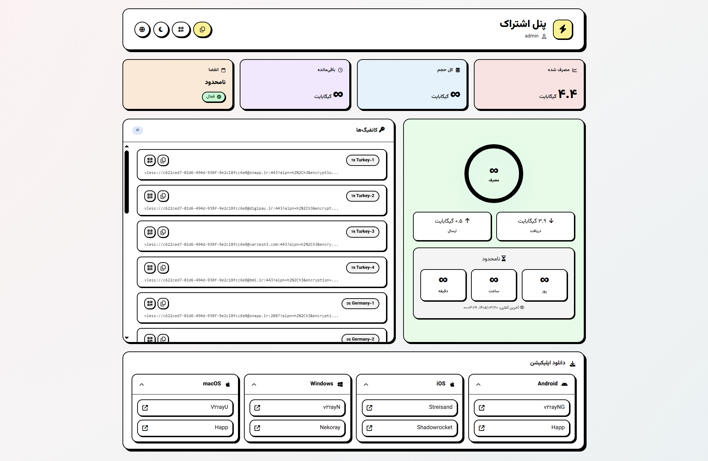

<div dir="rtl" align="right">

# 3x-hub

قالب اختصاصی و مدرن برای صفحه اشتراک پنل **3x-ui** نسخه **3.3.0 به بعد**.

**3x-hub** یک صفحه اشتراک کاستوم، مدرن، ریسپانسیو و دو زبانه (فارسی و انگلیسی) برای پنل **3x-ui** است که با طراحی نئوبروتالیسم پیاده‌سازی شده است.

## پیش‌نمایش قالب

### تم تاریک


### تم روشن


## ویژگی‌ها

- طراحی مدرن و ریسپانسیو (طرح نئوبروتالیسم)
- مناسب برای مرورگرهای موبایل، تبلت و دسکتاپ
- پشتیبانی کامل از زبان‌های فارسی و انگلیسی
- پشتیبانی از حالت تاریک و روشن (تغییر بر اساس تنظیمات سیستم کاربر و انتخاب دستی)
- نمایش حجم مصرف‌شده، حجم کل و حجم باقی‌مانده
- نمایش درصد مصرف به صورت گرافیکی
- نمایش زمان باقی‌مانده اشتراک
- نمایش وضعیت فعال یا غیرفعال بودن کاربر
- نمایش آخرین زمان اتصال کاربر
- نمایش کانفیگ‌های اختصاصی به‌صورت لیست
- امکان کپی لینک اشتراک و کانفیگ‌ها با یک کلیک
- امکان نمایش کیوآر کد (QR Code) برای لینک اشتراک و تک‌تک کانفیگ‌ها
- نمایش برنامه‌های پیشنهادی و کلاینت‌ها برای اندروید، آی‌اواس، ویندوز و مک
- سازگاری کامل با نسخه‌های جدید پنل 3x-ui

---

## نصب سریع

برای نصب سریع 3x-hub روی سرور، دستور زیر را در ترمینال سرور خود اجرا کنید:

```bash
bash <(curl -fsSL https://raw.githubusercontent.com/ramin-mahmoodi/3x-hub/main/install.sh)
```

پس از اجرا، فایل صفحه اشتراک در مسیر زیر جایگزین خواهد شد:

```bash
/etc/x-ui/sub/sub.html
```

---

## نصب دستی

اگر تمایل دارید نصب را به صورت دستی انجام دهید، دستورهای زیر را به ترتیب اجرا کنید:

```bash
mkdir -p /etc/x-ui/sub
curl -fsSL https://raw.githubusercontent.com/ramin-mahmoodi/3x-hub/main/sub.html -o /etc/x-ui/sub/sub.html
chmod 644 /etc/x-ui/sub/sub.html
```

---

## به‌روزرسانی

برای به‌روزرسانی 3x-hub به آخرین نسخه، کافیست مجدداً دستور نصب سریع را اجرا کنید:

```bash
bash <(curl -fsSL https://raw.githubusercontent.com/ramin-mahmoodi/3x-hub/main/install.sh)
```

---

## بررسی صحت نصب

برای بررسی اینکه آیا نصب با موفقیت انجام شده است:

```bash
ls -lah /etc/x-ui/sub/sub.html
```

برای مشاهده چند خط اول فایل دانلود شده:

```bash
head -n 5 /etc/x-ui/sub/sub.html
```

---

## راه‌اندازی مجدد پنل

پس از نصب، در صورت نیاز برای اعمال تغییرات، پنل 3x-ui را ری‌استارت کنید:

```bash
x-ui restart
```

یا از طریق سیستم‌دی:

```bash
systemctl restart x-ui
```

---

## ساختار فایل‌های پروژه

```text
3x-hub/
├── README.md
├── install.sh
└── sub.html
```

---

## نکات مهم

- این پروژه فقط قالب صفحه اشتراک را تغییر داده و فایل متناظر را جایگزین می‌کند.
- تنظیمات اصلی پنل و دیتابیس 3x-ui به هیچ وجه تغییر نخواهند کرد.
- پیش از نصب، اطمینان حاصل کنید که پنل 3x-ui روی سرور شما به درستی نصب و در حال اجرا است.
- اگر پیش از این صفحه اشتراک اختصاصی خودتان را داشته‌اید، حتماً قبل از نصب بکاپ تهیه کنید.

دستور تهیه بکاپ:

```bash
cp /etc/x-ui/sub/sub.html /etc/x-ui/sub/sub.html.bak
```

---

## حذف قالب

در صورتی که قصد دارید قالب 3x-hub را حذف کنید، از دستور زیر استفاده کنید:

```bash
rm -f /etc/x-ui/sub/sub.html
```

اگر پیش از نصب بکاپ تهیه کرده بودید، با این دستور آن را بازگردانی کنید:

```bash
mv /etc/x-ui/sub/sub.html.bak /etc/x-ui/sub/sub.html
```

---

## سازگاری

```text
3x-ui v3.3.0+
```

</div>
